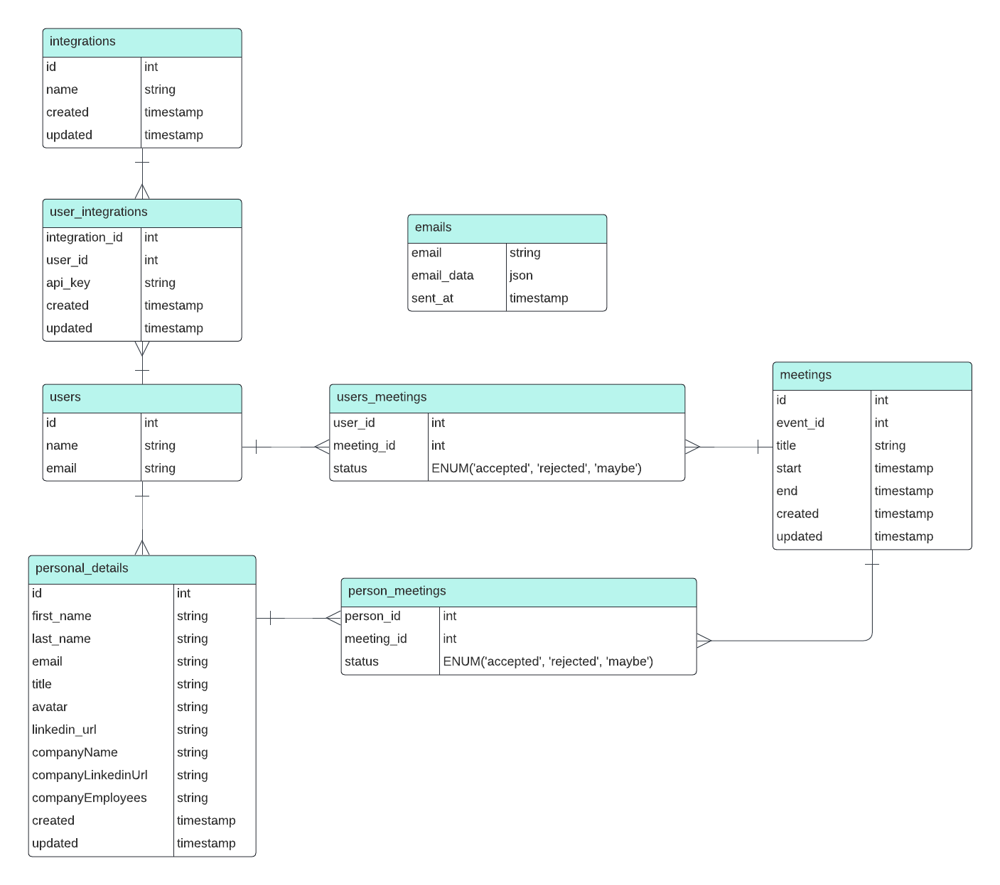

## Basics

The Laravel project was started using the sail up command for Linux; it may not work on Mac.
Run
```
./vendor/bin/sail up - d
```

or 
```
docker compose up -d
```

and then run migration
```
docker exec <container_name> php artisan migrate
```

The container name is displayed on

```
docker ps
```

## E.R Diagram



## Tests

The project was creating using TDD, it is possible to run the services with.
There is two main tests, to run the CalendarService and the MeetingService.

```
php artisan test
```

## A few considerations

The code starts with the ProcessUserMeetings command, which a supposed cronjob would run every morning.

This function uses calendarService to retrieve all meetings associated with the user, and meetingService to fetch the necessary information from the database.
```
$calendarEvents = $calendarService->fetchCalendarEvents($user);
$data = $meetingService->fetchMeetingInformation($user, $calendarEvents);
```
Consequently, it relies on PersonalDetailService, which uses the personal information API.
Then, it is using a job to trigger the email send to 8 AM.

```
SendEmailJob::dispatch($email)->delay(now()->startOfDay()->addHours(8));
```

